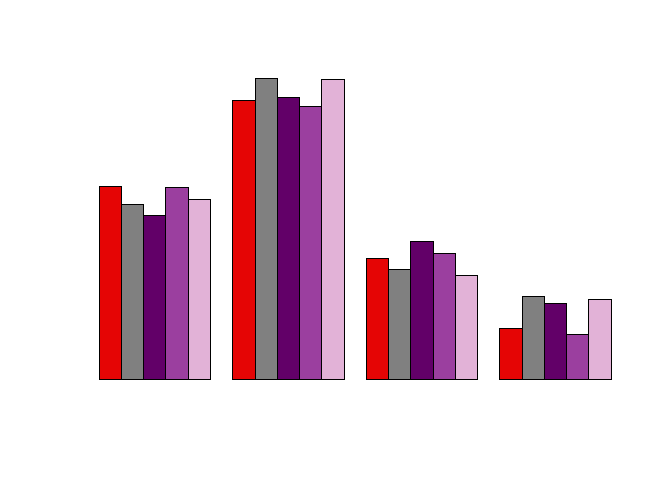

<!-- README.md is generated from README.Rmd. Please edit that file -->

# coresInsper

<!-- badges: start -->
<!-- badges: end -->

O objetivo do pacote é pegar as cores do insper

## Instalação

``` r
devtools::install_github("padsInsper/coresInsper")
```

## Todas as cores

``` r
library(coresInsper)
scales::show_col(cores_insper())
```


``` r
cores_insper(10)
#>  [1] "#000000" "#FFFFFF" "#E50505" "#3F3F3F" "#595959" "#808080" "#ABABAB"
#>  [8] "#DCDCDC" "#620068" "#CB8BDF"
```

## Exemplos

Exemplos de gráfico

``` r
colorspace::demoplot(cores_insper(15))
```


``` r
colorspace::demoplot(cores_insper(15), "heatmap")
```


``` r
colorspace::demoplot(cores_insper(5), "scatter")
```


``` r
colorspace::demoplot(cores_insper(15)[1:15 %% 3 == 0], "bar")
```


